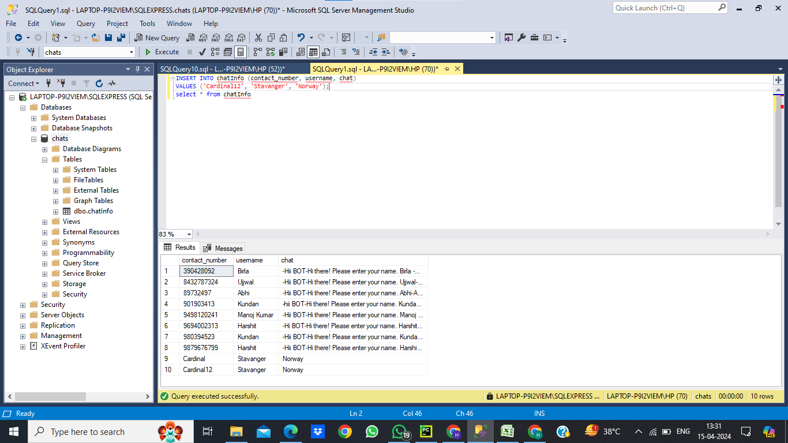

# AI Chat Bot

Creating an AI chat bot to answer the query of the users coming to purchase courses on any ed-tech website.

## Key Features 
1. Developed a user-friendly chat bot where users can input their queries regarding courses.

2. Integrated with a database of frequently asked questions (FAQs) related to courses. The chatbot can retrieve relevant answers from the FAQ database to respond to user queries.

3. Natural Language Processing (NLP) techniques used to understand user queries and extract key information required to provide relevant responses.

4. Implemented a mechanism where if a user is not satisfied with the response even after multiple tries, the chat bot will fallback to a doubt assistant for further assistance.

5. After resolving a user query, prompt the user for feedback on their satisfaction level. If the user is satisfied, end the chat session. If not, offer further assistance or escalation options.

6. Shares user data and chat transcripts with the sales executive team for follow-up and analysis purposes. Data is stored in a SQL Server database and should be in the form of CSV which the admin can download.

## Getting Started
To get started with the AI chat bot, simply type your query into the chat window and press enter. The chat bot will analyze your query and provide a relevant response. You can continue the conversation by typing follow-up queries or responses.

## Screenshots
### App Screenshot


### Data Base Screenshot


### Excel Screenshot


### New Query Addition Screenshot


## Installation
#### 1. Clone the repository
```bash
  git clone [https://github.com/harshit9693/AI-CHATBOT.git]
```

#### 2. Navigate into the project directory
```bash
  cd your-repository
```

#### 3. Install requirements
```bash
  pip install -r requirements.txt
```

#### 4. Start the application
```bash
  python app.py
```

#### 5. Access the application
once the application is running , you have an access to the chatbot at the below right corner on the webpage . Now you can start your conversation with the chatbot.

## Python libraries used to make the project 
### 1. Pandas 
  Used for data manipulation and analysis.
### 2. NumPy
  Provides support for large, multi-dimensional arrays and matrices, along with mathematical functions to operate on these arrays.
### 3. NLTK (Natural Language Toolkit)
  Used for natural language processing tasks such as tokenization, stemming, lemmatization, parsing, and more.
### 4. Torch (PyTorch)
  A deep learning library for tensor computations and building neural networks.
### 5. PyODBC
   Provides a Python DB API 2.0 interface for ODBC (Open Database Connectivity)
### 6. Flask
  A lightweight web application framework for Python used for building web applications.

## Connection to Database
 To store all the user information which includes username , contact details and the transcript of chat we have used the SQL Server Management Studio 20 , in which we have created a database which stores these information.
### To connect the database with the python file use 
#### 1. import pyodbc
```bash
  import pyodbc
```
#### 2. make a connection
```bash
  conn = pyodbc.connect('DRIVER={Devart ODBC Driver for SQL Server};Server=myserver;Database=mydatabase;')
```
#### 3. Write Thank you / Bye in chatbot after the conversation so that the data is saved in the database.

## How to use ?
1. Clone the project.
2. Install all the packages from the requirements.txt file.
3. Create a database in the SQL Server Management Studio and make a table having username, contact_number and chat as a column
4. keep contact_number as a primary key
5. Connect the db.py file with the sql server.
6. export the database from the sql server to the excel through OMDB.
7. run all the python files 
8. run app.py file and you are ready to interact with the webpage.
9. At the end of converasation ,write bye/Thank you in the chatbox for the feedback and save the data.
